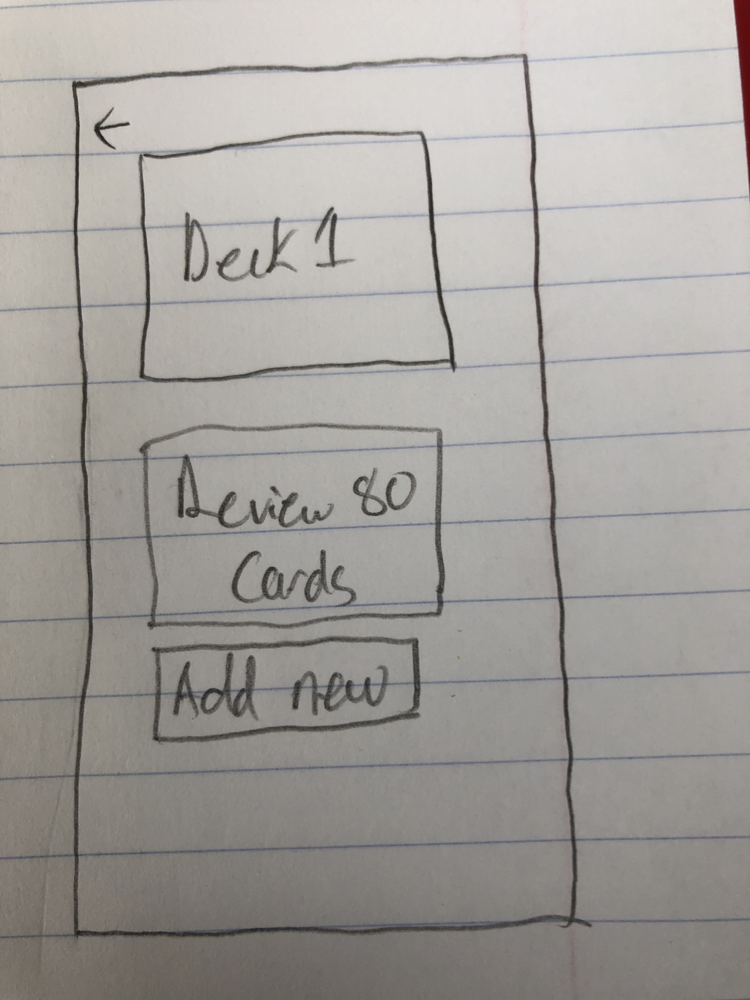

# vocabuleasy

A flashcard app built as a term project for CSC690

## Team members:

- Eric Groom (Developer)
- Tommy Lik (Reviewer)

## Proposal

Vocabuleasy is an app to help language-learners learn vocabulary in their target language in a quick and efficient manner, while minimizing the time it takes to create flashcards by hand.

### Must-have features (with estimates)

- Reviewing created flashcards (4hrs)
- Creating new text-based flashcards (2hrs)
- Creating new flashcards with media (images, sound) (4hrs)
- Scheduling the review of flashcards with an Spaced-Repetition System (SRS) algorithm (6hrs)
- Automatic sourcing of pronunciation, example sentences, photos when creating a flashcard (15hrs)

### Nice-to-have features

- Statistics on the user's learning performance (6hrs)
- Custom card templates (5hrs)
- More review schedulers (i.e. cramming) (1hr)

## Wireframes

**Reviewing Cards**

**Creating New Cards**

**List of Flashcard Decks**

**Flashcard Deck Detail**

## Glossary

- **Flashcard or Card**: A set of fields with two-sides that can be made of images, audio or text. The user creates them and uses them to quiz themself on their target langauge.
- **Deck**: A collection of flashcards. A deck must be comprised of only one language for sourcing features to work properly
- **Review Session**: Refers to the a set of cards the user reviews in a given time, can also refer to the time itself.
- **Spaced Repetition System (SRS)**: Cognitive studies have shown that we best remember information that we are reminded of right before we forget it, rather than reviewing it endlessly. Additionally, we forget things on a predictable curve. We can exploit this by presenting information to the user in increasing time increments so that they man more easily memorize whatever they wish to learn.
